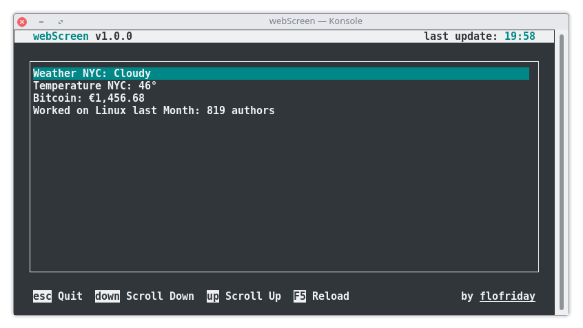
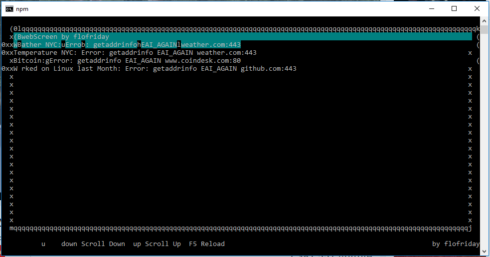

# webScreen
Monitor your web right from the terminal.

## Features
* Customizable UI
* Mouse Support
* Save the downloaded values in .csv or .txt
* Cross Platform (Windows, macOS, GNU/Linux, FreeBSD, NetBSD, OpenBSD)

## Install and Setup
1. Download the newest [release](https://github.com/flofriday/webScreen/releases/tag/1.0.0).
2. Unzip the folder.
3. Run the webscreen executable.

### For Developer
1. [Download](https://github.com/flofriday/webScreen/releases/download/0.3.0/webScreen0-3-0.zip "Click to download") webScreen and unzip.
2. [Download](https://nodejs.org/en/download/ "Go to www.nodejs.org") node.js if you haven't done yet.
3. Open items.json with a text editor and configure it. Instructions [here](doc/items-json.md).
4. Open config.json with a text editor and configure it. Instructions [here](doc/config-json.md).
5. Open a terminal and type `npm install` to install all dependencies.
6. To start the app type `npm start`

## Development State
Since webScreen has now all the features I need for my personal use, I won't write further code for it. However, I will react to issues and pull requests and even develop features if requested.

## ~~Bugs~~ Random Developed Features
* webScreen crashes if the data file is used by another program.

### Windows Features
Since Microsoft hasn't worked on CMD in years webScreen doesn't work there that well:

* Most CMD fonts don't work. In that case you have to disable the borders in [config.json](doc/config-json.md).
* webScreen can't resize vertically.
* No mouse support.

## License
[MIT](LICENSE)
